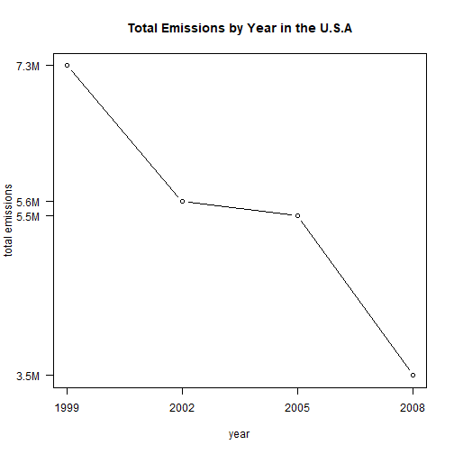
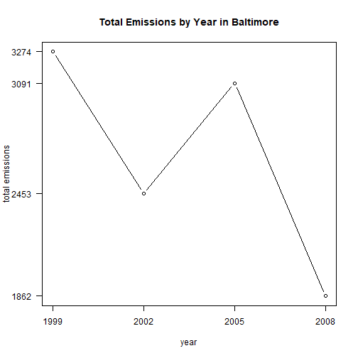
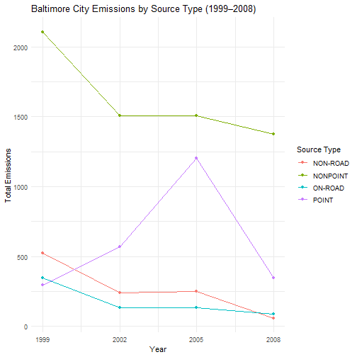
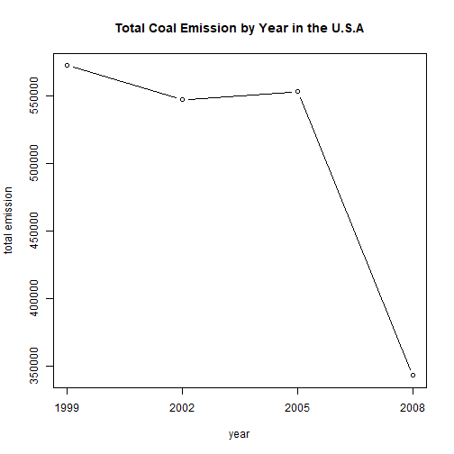
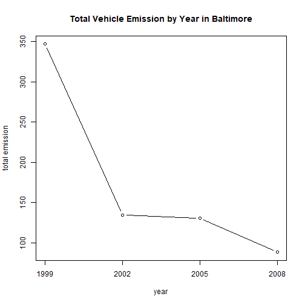
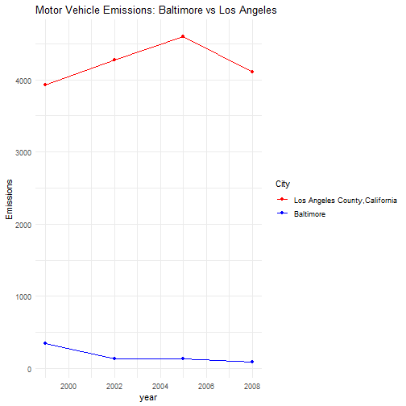

PM2.5 Emissions Analysis
===================================


---


This repository contains my completed **EDA Project - Part 2**, analyzing **PM2.5** emissions in the U.S. from 1999–2008 using R and the [**EPA NEI dataset**](https://d396qusza40orc.cloudfront.net/exdata%2Fdata%2FNEI_data.zip).
 

---


## Project Overview

**Fine particulate matter (PM2.5)** is one of the most harmful ambient air pollutants affecting human health.

The **EPA’s National Emissions Inventory (NEI)** provides data every three years on the total tons of PM2.5 emitted across the United States by various source types (point, nonpoint, on-road, and non-road).

This project answers six analytical questions about how PM2.5 emissions have evolved between **1999 and 2008**, both nationwide and for specific regions (Baltimore and Los Angeles).


---


## Data Dictionary

| Variable | Description |
| --- | --- |
| **fips** | A five-digit string indicating the U.S. county. |
| **SCC** | The Source Classification Code identifying the type of emission source. |
| **Pollutant** | The pollutant name (in this dataset: always `PM25-PRI`). |
| **Emissions** | The total amount of PM2.5 emitted (in tons). |
| **type** | The emission source type — one of `POINT`, `NONPOINT`, `ON-ROAD`, or `NON-ROAD`. |
| **year** | The year of emissions recorded (1999, 2002, 2005, or 2008). |


---


## Analysis Questions and Plots

I am using "ggplot2", "here" and "dplyr" packages and [**EPA NEI dataset**](https://d396qusza40orc.cloudfront.net/exdata%2Fdata%2FNEI_data.zip) as mentioned before.

``` r
library(ggplot2)
library(dplyr)
library(here)
data <- readRDS(here("summarySCC_PM25.rds"))
SCC <- readRDS(here("Source_Classification_Code.rds"))
```

### **Plot 1 — Total U.S. Emissions**

**Question:** Have total PM2.5 emissions decreased in the United States from 1999 to 2008?


``` r
plot1<-with(data,tapply(Emissions,year,sum))
plot(names(plot1),plot1,type = "b",
     xlab = "year",
     ylab = "total emissions",
     main = "Total Emissions by Year in the U.S.A",
     xaxt="n", yaxt="n")
axis(1, at =c(1999,2002,2005,2008) , 
     labels = c(1999,2002,2005,2008))
axis(2,at=c(plot1[1:4]),labels =c ("7.3M","5.6M","5.5M","3.5M"),las=2)
```



### **Plot 2 — Baltimore City Emissions**

**Question:** Have total PM2.5 emissions decreased in Baltimore City, Maryland (`fips == "24510"`) from 1999 to 2008?


``` r
baltimore<-subset(data,data$fips=="24510")
plot2<-with(baltimore,tapply(Emissions,year,sum))
plot(names(plot2),plot2,type="b",
           xlab = "year",
           ylab = "total emissions",
           main = "Total Emissions by Year in Baltimore",
           xaxt="n", yaxt="n")
axis(1, at =c(1999,2002,2005,2008) , 
     labels = c(1999,2002,2005,2008))
axis(2,at=c(plot2[1:4]),labels = c(trunc(plot2[1:4])),las=2)
```



### **Plot 3 — Emissions by Source Type in Baltimore**

**Question:** Which emission source types (point, nonpoint, onroad, nonroad) have increased or decreased in Baltimore City between 1999 and 2008?


``` r
baltimore<-data[data$fips=="24510",]
plot3<-baltimore %>%
        group_by(type,year )%>%
        summarise(Emissions=sum(Emissions),
                  .groups = "drop")
ggplot(plot3,aes(x=year,y=Emissions,colour = type))+
        geom_line()+
        geom_point()+
        labs(title = "Baltimore City Emissions by Source Type (1999–2008)",
             x="Year",
             y="Total Emissions",
             color="Source Type")+
        scale_x_continuous(breaks =c(1999,2002,2005,2008)) +
        theme_minimal()
```



### **Plot 4 — Coal Combustion-Related Emissions**

**Question:** How have PM2.5 emissions from coal combustion-related sources changed across the United States from 1999 to 2008?


``` r
coal<-subset(SCC,EI.Sector %in% 
        c("Fuel Comb - Electric Generation - Coal",
        "Fuel Comb - Industrial Boilers, ICEs - Coal",
        "Fuel Comb - Comm/Institutional - Coal"))
data_coal<-subset(data,SCC %in% coal$SCC)
plot4<-with(data_coal,tapply(Emissions,year,sum))
plot(names(plot4),plot4,type = "b",
     xlab = "year",
     ylab = "total emission",
     main = "Total Coal Emission by Year in the U.S.A",
     xaxt="n")
axis(1, at =c(1999,2002,2005,2008) , 
     labels = c(1999,2002,2005,2008))
```



### **Plot 5 — Motor Vehicle Emissions in Baltimore**

**Question:** How have PM2.5 emissions from motor vehicle sources changed from 1999 to 2008 in Baltimore City?


``` r
baltimore<-data[data$fips=="24510",]
vehicle_names<-unique(SCC$EI.Sector)[21:24]
vehicle<-subset(SCC,EI.Sector%in% vehicle_names)
balt_vehicle<-subset(baltimore,baltimore$SCC %in% vehicle$SCC)
plot5<-with(balt_vehicle,tapply(Emissions,year,sum))
plot(names(plot5),plot5,type = "b",
     xlab = "year",
     ylab = "total emission",
     main = "Total Vehicle Emission by Year in Baltimore",
     xaxt="n")
axis(1, at =c(1999,2002,2005,2008) , 
     labels = c(1999,2002,2005,2008))
```



### **Plot 6 — Baltimore vs. Los Angeles Vehicle Emissions**

**Question:** How do trends in motor vehicle emissions compare between Baltimore City (`fips == "24510"`) and Los Angeles County (`fips == "06037"`) from 1999 to 2008?


``` r
vehicle_names<-unique(SCC$EI.Sector)[21:24]
vehicle<-subset(SCC,EI.Sector%in% vehicle_names)
balt_LA<-data[data$fips%in% c("24510","06037"),]
vehicle_balt_LA<-subset(balt_LA,SCC %in% vehicle$SCC)
plot6<-vehicle_balt_LA%>% group_by(City=fips,year)%>%
        summarise(Emissions=sum(Emissions),.groups = "drop")
ggplot(plot6,aes(x=year,y=Emissions,color=City))+
        geom_line()+
        geom_point()+
        scale_color_manual(values = c("06037"="red","24510"="blue"),
                           labels=(c("06037"="Los Angeles County,California","24510"="Baltimore")))+
        theme_minimal()+
        labs(title = "Motor Vehicle Emissions: Baltimore vs Los Angeles")
```




---


## Summary

* Nationwide emissions have steadily declined, suggesting effective regulatory measures or shifts in industrial activity.

* Baltimore City shows a similar downward trend, though the rate and consistency vary by source type.

* Point and non-road sources in Baltimore saw notable reductions, while on-road emissions remained relatively stable.

* Coal combustion-related emissions decreased across the U.S., reflecting a broader move away from coal-based energy.

* Motor vehicle emissions in Baltimore dropped modestly, while Los Angeles showed a sharper decline, possibly due to stricter local policies or technological adoption.

These findings highlight how emission patterns differ by region and source, offering a snapshot of environmental progress over a decade. While the analysis is not exhaustive, it demonstrates my ability to work with real-world data, apply tidy workflows, and communicate insights through visual storytelling. This project was completed as part of a [*Johns Hopkins University
 Data Science: Foundations using R Specialization course *](https://www.coursera.org/learn/r-programming) assignment focused on practicing data visualization in R.
 
 
---


### Thank you for reviewing this analysis.
 *Apostolos Karyofyllis*
